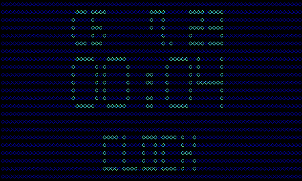

deskclock
=========

Simple clock app for Raspberry Pi



Installing
----------

Run command and you're all set!

```bash
go get -u github.com/kapitanov/deskclock
```

Running
-------

Just type in a command:


```bash
deskclock
```

Hit `ESC` to exit or `Space` to force redraw